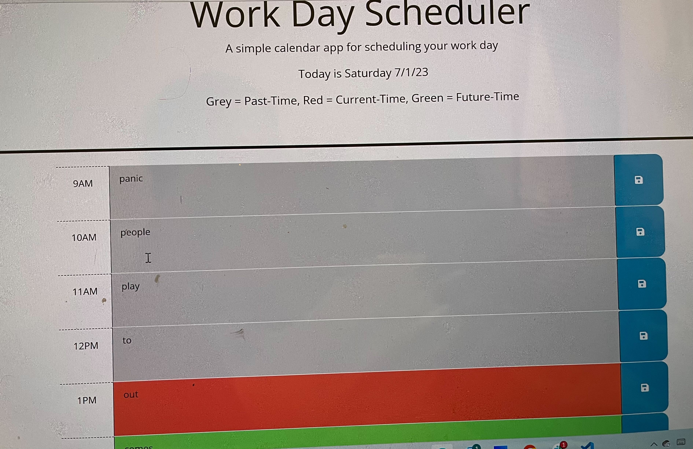

# 05 Third-Party APIs: Work Day Scheduler

## Fully functional Work Day Scheduler
This project was built in VS Code,  with the help of starter code i was able to generate a work day scheduler that consist of times ranging from 9AM-5PM, with this code you are able to input text into any time block hour & save it in case of a hard refresh or just closing out the browser with help of the local storage. Also the date is in the header and is updated everyday with dayjs(), You are given a color-key to dicate if each hour is in the past present or future!

* WHEN User opens the planner, THEN the current day is 
displayed at the top of the calendar
* WHEN User scrolls down, THEN User is presented with timeblocks for standard business hours of 9am-5pm
 * WHEN User views the timeblocks for that day, THEN each timeblock is color coded to indicate whether it is in the past, present, or future
 * WHEN User clicks into a timeblock, THEN User can enter an event
 * WHEN User clicks the save button for that timeblock,
THEN the text for that event is saved in local storage
* WHEN User refresh the page, THEN the saved events persist

## Visual Helper

## Installation instructions
To install this You will first need Visual Studio Code
To install this you will need Git Bash, or a terminal that is convienent for your computer
## Usage
* Step 1- you will want to create a folder using your terminal anyname works!
*step 2- you want to create a repository to your local environment(Terminal) using command- git init
* step 3- you will want to open up this code from your terminal onto Visual Studio Code using command- code .
*Step 4- once VS-Code is open you will click open folder, and find the folder you named in (step #1)
* Step 5- you will notice that the folder is empty, go ahead and create 3 new files and rename them(index.html,script.js, & style.css) by right clicking over the untitled file, then click rename!
* Step 6- Go ahead back to where you found my gitgub pages, and copy the index.html, and paste it into yours!
* Step 7- Go ahead back to where you found my gitgub pages, and copy the style.css, and paste it into yours!
* Step 8 - Go ahead back to where you found my gitgub pages, and copy the Javacript, and paste it into yours!
* Step 10- From here on out this is where you can edit the code to better reflect your own touch to creativity!!

* Urgent on line 5 of index you will see my relative pathway for my project, your relative pathway most likely will differ, so go ahead and change it so the index.html, javascript and style.css can work like teamates.
## For help
*please refer to this video for help on relative pathways- https://www.youtube.com/watch?v=hxto_sRZsBg

please refer to this video for help on Creating folders & files using your terminal- https://www.youtube.com/watch?v=cllYCk-MYek
## Liscence
MIT License

Copyright (c) [2023] [Tyler Henderson Webster]

Permission is hereby granted, free of charge, to any person obtaining a copy of this software and associated documentation files (the "Software"), to deal in the Software without restriction, including without limitation the rights to use, copy, modify, merge, publish, distribute, sublicense, and/or sell copies of the Software, and to permit persons to whom the Software is furnished to do so, subject to the following conditions:

The above copyright notice and this permission notice shall be included in all copies or substantial portions of the Software.

THE SOFTWARE IS PROVIDED "AS IS", WITHOUT WARRANTY OF ANY KIND, EXPRESS OR IMPLIED, INCLUDING BUT NOT LIMITED TO THE WARRANTIES OF MERCHANTABILITY, FITNESS FOR A PARTICULAR PURPOSE AND NONINFRINGEMENT. IN NO EVENT SHALL THE AUTHORS OR COPYRIGHT HOLDERS BE LIABLE FOR ANY CLAIM, DAMAGES OR OTHER LIABILITY, WHETHER IN AN ACTION OF CONTRACT, TORT OR OTHERWISE, ARISING FROM, OUT OF OR IN CONNECTION WITH THE SOFTWARE OR THE USE OR OTHER DEALINGS IN THE SOFTWARE. © 2023 edX Boot Camps LLC. Confidential and Proprietary. All Rights Reserved.

 ## Review
 deployed app URL - https://tyythedeveloper33.github.io/work-dayScheduler/

 github repository - https://github.com/Tyythedeveloper33/work-dayScheduler
